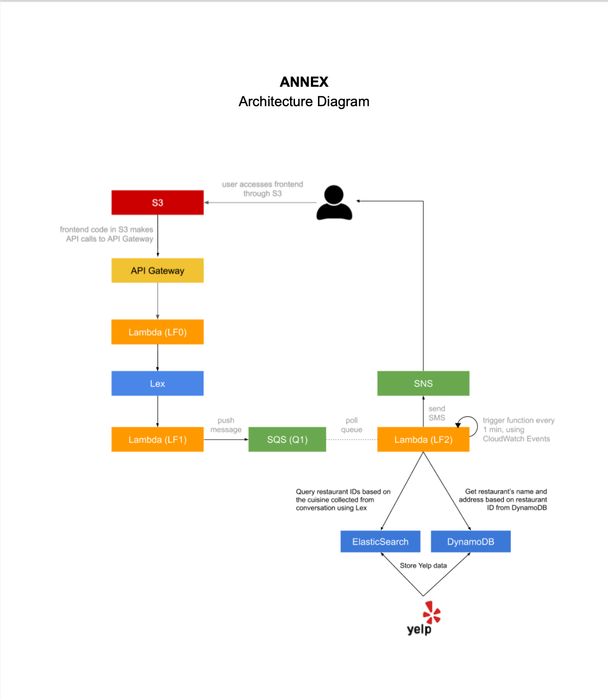
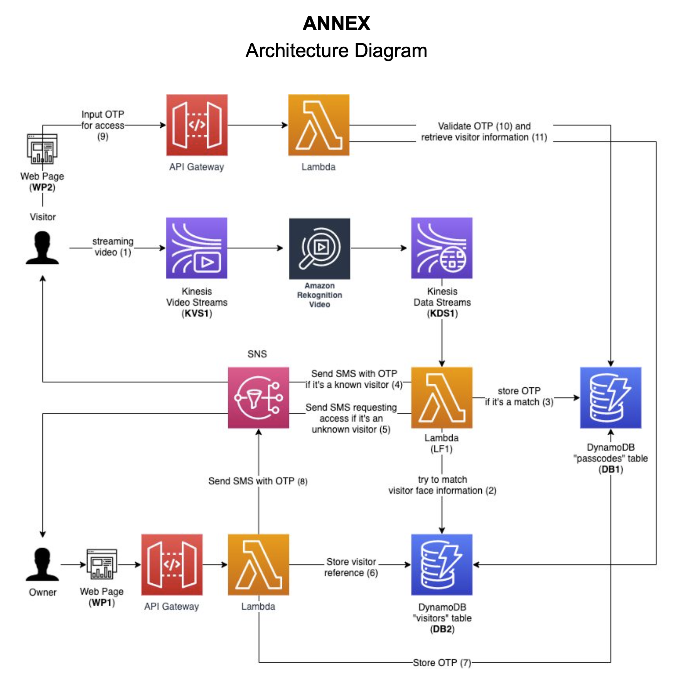
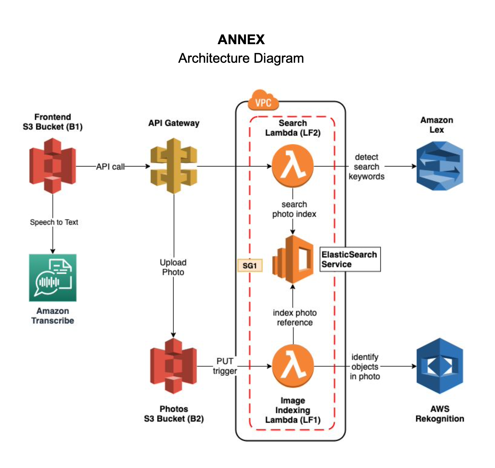
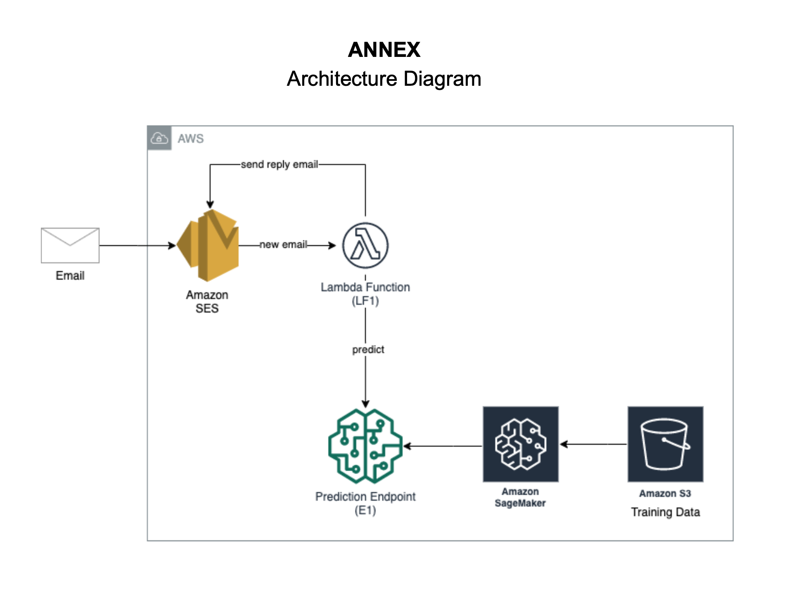

# Cloud_Computing_Big_data_Web_projects

## Lab1: Dining Concierge Agent
### Description
- Implement and host a chat user interface on AWS S3, integrating a resful chat APIs built from swagger specification on AWS API Gateway. 

- Train and deploy the Lex chatbot for the purpose of dining concierge agent, extracting and then pushing customer's perferred information into SQS queue.

- Deploy detailed restaurants' information collected from Yelp API on Amazon DynamoDB, combining with Elasticsearch service to optimize searching mechanism.

- Built suggestion mode(Lambda) asychronously operating SQS message queue, retrieving recommended restaurants and cuisines and notifying customers by SNS services. And set up a CloudWatch event trigger to automate the request processing.

Demo Link: https://hw1-chatbot.s3.amazonaws.com/index.html

Example Iteration:

example Interaction:

User: Hello

Bot: Hi there, how can I help?

User: I need some restaurant suggestions.

Bot: Great. I can help you with that. What city or city area are you looking to dine in?

User: Manhattan

Bot: Got it, Manhattan. What cuisine would you like to try?

User: Japanese

Bot: Ok, how many people are in your party?

User: Two

Bot: A few more to go. What date?

User: Today

Bot: What time?

User: 7 pm, please

Bot: Great. Lastly, I need your phone number so I can send you my findings.

User: 123-456-7890

Bot: You’re all set. Expect my suggestions shortly! Have a good day.

User: Thank you!

Bot: You’re welcome.

### Architecture:

## Lab2: Smart Door Security
### Description

Processed streaming video by Kinesis video streams to perform stream analysis to identify faces by Rekognition service.
Identified known people and provide them with an automatic OTP(one-time passcode) acess code.
Triggered an identification workflow(webpages,SNS, restful API) that allows or denies access to unknown visitors, as well as adds them to the database for future training.

Storage: 
DB1: stores temporary access codes(TTL DynamoDB)
DB2: stores details about the visitors, Index each visitor by the FaceId detected by Amazon Rekognition
S3(B1): store photos of visitors

WP2: The web page prompts the user to input the OTP for validation 

WP1: The web page collects the name and phone number of the visitor via a web form

Demo Link: 

webpage 1 : https://hw2-wp1.s3.amazonaws.com/index.html

webpage 2:  https://hw2-wp2.s3.amazonaws.com/index.html

### Architecture:

## Lab3: Voice Enabled Photo Album
### Description
Demo Link: https://hw3-wp.s3.amazonaws.com/index.html

### Architecture:

## Lab4: Intelligent System On Cloud
### Description
Demo Link:  

### Architecture:

